ETFs
================
DanielH
December 27, 2018

-   [ETFs analysis](#etfs-analysis)
    -   [XLK case](#xlk-case)
    -   [Vanguard S&P 500 case](#vanguard-sp-500-case)
    -   [Vanguard Total Stock Market case](#vanguard-total-stock-market-case)
    -   [Vanguard Short-Term Bond ETF](#vanguard-short-term-bond-etf)
    -   [Vanguard Growth ETF](#vanguard-growth-etf)
    -   [SP 500 index vs ETF](#sp-500-index-vs-etf)

``` r
library(tidyverse)
library(purrrlyr)
library(tidyquant)
library(ggthemes)
library(scales)
library(knitr)

# set theme
theme_set(theme_minimal())
```

ETFs analysis
=============

Here we want to get the period returns ofr ETFs, on both a monthly and yearly basis

XLK case
--------

<https://www.etf.com/XLK#overview>

``` r
# monthly returns
xlk_monthly_returns <- "XLK" %>%
    tq_get(get  = "stock.prices",
           from = "2010-01-01",
           to   = "2018-12-28") %>%
    tq_transmute(select     = adjusted, 
                 mutate_fun = periodReturn, 
                 period     = "monthly", 
                 col_rename = "Rb")


# plot monthly returns
xlk_monthly_returns %>%
  ggplot(aes(date, Rb)) +
  geom_line(color = "steelblue") +
  geom_point(color = "steelblue", size = 1) +
  geom_hline(yintercept = 0, color = "red", size = 1) +
  scale_y_continuous(labels = percent_format()) +
  labs(title = "Monthly returns XLK etf", x = "", y = "",
       subtitle = "years 2010-2018")
```

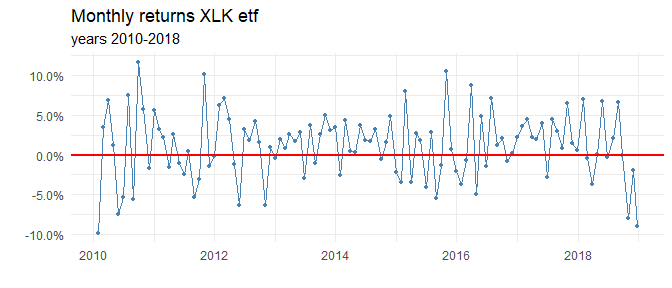

``` r
# yearly returns
xlk_yearly_returns <- "XLK" %>%
    tq_get(get  = "stock.prices",
           from = "2010-01-01",
           to   = "2018-12-31") %>%
    tq_transmute(select     = adjusted, 
                 mutate_fun = periodReturn, 
                 period     = "yearly", 
                 col_rename = "Rb")


# plot yearly returns
xlk_yearly_returns %>%
  mutate(year = year(date)) %>%
  ggplot(aes(year, Rb)) +
  geom_bar(stat = "identity", fill = "steelblue") +
  scale_y_continuous(labels = percent_format()) +
  scale_x_continuous(breaks = seq.int(2010, 2018, 1)) +
  labs(title = "Yearly returns XLK etf", x = "", y = "",
       subtitle = "years 2010-2018")
```

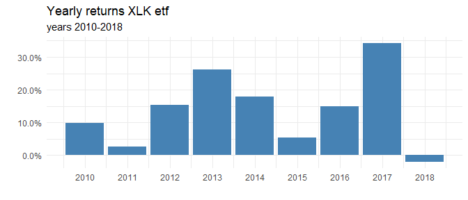

Vanguard S&P 500 case
---------------------

The (*NYSEARCA: VOO*) is one of Vanguard's lowest-cost ETFs with a 0.04% expense ratio. It is also among the largest with $310.7 billion in assets under management (AUM), according to Vanguard's website. The fund's objective is to track the performance of the Standard & Poor's 500 Index. Its top holdings are Apple Inc. (*NASDAQ: AAPL*), Microsoft Corp. (*NASDAQ: MSFT*), and Alphabet Inc. (*NASDAQ: GOOGL*).

``` r
# get data
vanguard_sp500 <- tq_get("VOO")

# monthly returns
vanguard_sp500_monthly_returns <- "VOO" %>%
    tq_get(get  = "stock.prices",
           from = "2010-01-01",
           to   = "2018-12-28") %>%
    tq_transmute(select     = adjusted, 
                 mutate_fun = periodReturn, 
                 period     = "monthly", 
                 col_rename = "Rb")

# plot monthly returns
vanguard_sp500_monthly_returns %>%
  ggplot(aes(date, Rb)) +
  geom_line(color = "darkolivegreen") +
  geom_point(color = "darkolive green", size = 1) +
  geom_hline(yintercept = 0, color = "red") + 
  labs(title = "Vanguard S&P 500 ETF performance", x = "", y = "",
       subtitle = "september 9 2010,  december 20 2018") +
  scale_y_continuous(labels = percent_format())
```

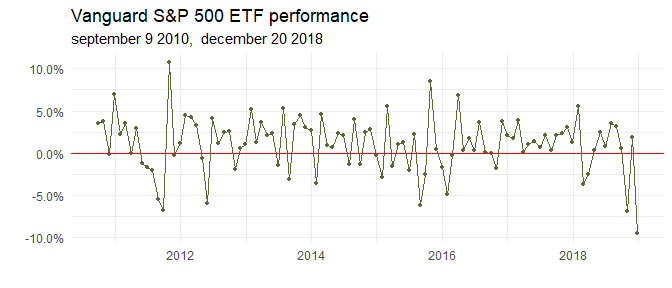

``` r
# yearly returns
vanguard_sp500_yearly_returns <- "VOO" %>%
    tq_get(get  = "stock.prices",
           from = "2010-01-01",
           to   = "2018-12-31") %>%
    tq_transmute(select     = adjusted, 
                 mutate_fun = periodReturn, 
                 period     = "yearly", 
                 col_rename = "Rb")


# plot yearly returns
vanguard_sp500_yearly_returns %>%
  mutate(year = year(date)) %>%
  ggplot(aes(year, Rb)) +
  geom_bar(stat = "identity", fill = "darkolivegreen") +
  scale_y_continuous(labels = percent_format()) +
  scale_x_continuous(breaks = seq.int(2010, 2018, 1)) +
  labs(title = "Yearly returns XLK etf", x = "", y = "",
       subtitle = "years 2010-2018")
```

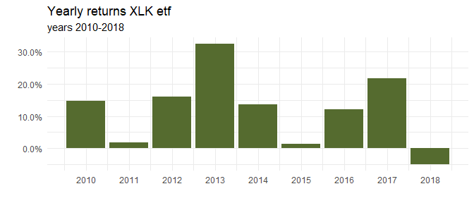

Vanguard Total Stock Market case
--------------------------------

The Vanguard Total Stock Market ETF (*NYSEARCA: VTI*) is Vanguard's oldest and largest ETF with $549.6 billion in AUM. For a rock bottom fee of 0.04% the fund covers the entire U.S. stock market. Its top holdings are Apple, Alphabet, and Microsoft.

``` r
# monthly returns
vanguard_sptotal_monthly_returns <- "VTI" %>%
    tq_get(get  = "stock.prices",
           from = "2010-01-01",
           to   = "2018-12-28") %>%
    tq_transmute(select     = adjusted, 
                 mutate_fun = periodReturn, 
                 period     = "monthly", 
                 col_rename = "Rb")

# plot monthly returns
vanguard_sptotal_monthly_returns %>%
  ggplot(aes(date, Rb)) +
  geom_line(color = "darkorange") +
  geom_point(color = "darkorange", size = 1) +
  geom_hline(yintercept = 0, color = "black") + 
  labs(title = "Vanguard S&P Total ETF performance", x = "", y = "",
       subtitle = "september 9 2010,  december 20 2018") +
  scale_y_continuous(labels = percent_format())
```

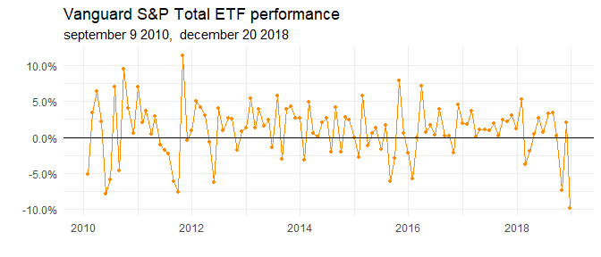

``` r
# yearly returns
vanguard_sptotal_yearly_returns <- "VTI" %>%
    tq_get(get  = "stock.prices",
           from = "2010-01-01",
           to   = "2018-12-31") %>%
    tq_transmute(select     = adjusted, 
                 mutate_fun = periodReturn, 
                 period     = "yearly", 
                 col_rename = "Rb")

# plot yearly returns
vanguard_sptotal_yearly_returns %>%
  mutate(year = year(date)) %>%
  ggplot(aes(year, Rb)) +
  geom_bar(stat = "identity", fill = "darkorange") +
  scale_y_continuous(labels = percent_format()) +
  scale_x_continuous(breaks = seq.int(2010, 2018, 1)) +
  labs(title = "Yearly returns VTI etf", x = "", y = "",
       subtitle = "years 2010-2018")
```

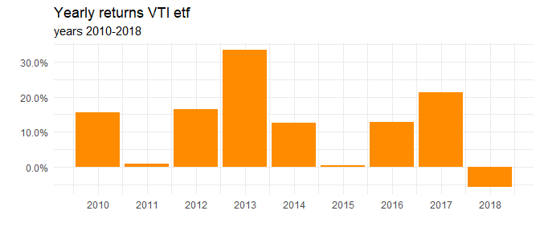

Vanguard Short-Term Bond ETF
----------------------------

The Vanguard Short-Term Bond ETF (*NYSEARCA: BSV*) invests in U.S. government, investment-grade corporate and international dollar-denominated bonds. Its benchmark is the Bloomberg Barclays 1-5 Year Government/Credit Float Adjusted Index. In adherence to its investment mandate, the fund is heavily weighted towards short-term U.S. Treasury bonds, with the largest holdings being 1-3 Years (56.3%) and 3-5 Years (42.7%).

``` r
# monthly returns
bsv_montly_returns <-
  "BSV" %>% 
  tq_get(get  = "stock.prices",
           from = "2010-01-01",
           to   = "2018-12-28") %>%
    tq_transmute(select     = adjusted, 
                 mutate_fun = periodReturn, 
                 period     = "monthly", 
                 col_rename = "Rb")


# plot monthly returns
bsv_montly_returns %>%
  ggplot(aes(date, Rb)) +
  geom_line(color = "firebrick") +
  geom_point(color = "firebrick", size = 1) +
  geom_hline(yintercept = 0, color = "blue", size = 1) +
  scale_y_continuous(labels = percent_format()) +
  labs(title = "monthly returns BSV etf",
       x = "", y = "")
```

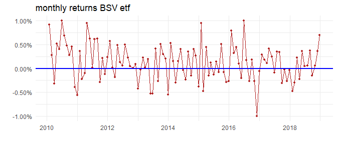

``` r
# monthly returns
bsv_yearly_returns <-
  "BSV" %>% 
  tq_get(get  = "stock.prices",
           from = "2010-01-01",
           to   = "2018-12-28") %>%
    tq_transmute(select     = adjusted, 
                 mutate_fun = periodReturn, 
                 period     = "yearly", 
                 col_rename = "Rb")

# plot yearly returns
bsv_yearly_returns %>%
  mutate(year = year(date)) %>%
  ggplot(aes(year, Rb)) +
  geom_bar(stat = "identity", fill = "firebrick") +
  scale_y_continuous(labels = percent_format(), limits = c(-0.001, 0.04)) +
  scale_x_continuous(breaks = seq.int(2010, 2018, 1)) +
  labs(title = "Yearly returns BSV etf", x = "", y = "")
```

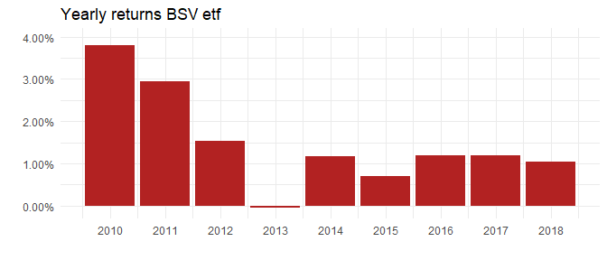

Vanguard Growth ETF
-------------------

The Vanguard Growth ETF (NYSEARCA: VUG) invests in stocks of large-cap companies with high-growth potential. Its $60.2 billion in assets are heavily weighted towards technology stocks, with Apple, Alphabet, Amazon.com Inc. (NASDAQ: AMZN), and Facebook Inc. (NYSE: FB). comprising the top holdings.

``` r
# monthly returns
vug_montly_returns <-
  "VUG" %>% 
  tq_get(get  = "stock.prices",
           from = "2010-01-01",
           to   = "2018-12-28") %>%
    tq_transmute(select     = adjusted, 
                 mutate_fun = periodReturn, 
                 period     = "monthly", 
                 col_rename = "Rb")


# plot monthly returns
vug_montly_returns %>%
  ggplot(aes(date, Rb)) +
  geom_line(color = "darkgreen") +
  geom_point(color = "darkgreen", size = 1) +
  geom_hline(yintercept = 0, color = "red", size = 1) +
  scale_y_continuous(labels = percent_format()) +
  labs(title = "monthly returns VUG etf",
       x = "", y = "")
```

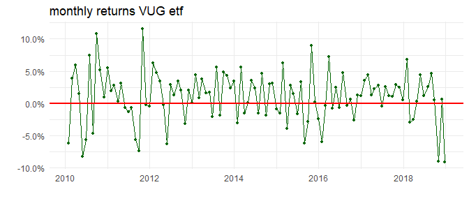

``` r
# monthly returns
vug_yearly_returns <-
  "VUG" %>% 
  tq_get(get  = "stock.prices",
           from = "2010-01-01",
           to   = "2018-12-28") %>%
    tq_transmute(select     = adjusted, 
                 mutate_fun = periodReturn, 
                 period     = "yearly", 
                 col_rename = "Rb")

# plot yearly returns
vug_yearly_returns %>%
  mutate(year = year(date)) %>%
  ggplot(aes(year, Rb)) +
  geom_bar(stat = "identity", fill = "firebrick") +
  scale_y_continuous(labels = percent_format(), limits = c(-0.1, 0.35)) +
  scale_x_continuous(breaks = seq.int(2010, 2018, 1)) +
  labs(title = "Yearly returns BSV etf", x = "", y = "")
```

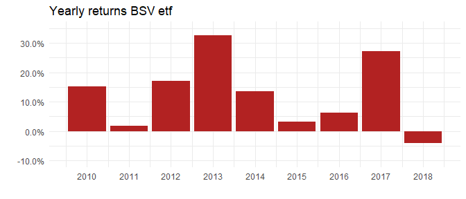

------------------------------------------------------------------------

SP 500 index vs ETF
-------------------

``` r
"^GSPC" %>%
  tq_get() %>%
  ggplot(aes(date, adjusted)) +
  geom_line()
```

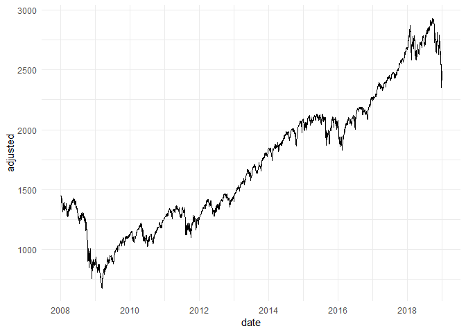

``` r
"VUG" %>%
  tq_get() %>%
  ggplot(aes(date, adjusted)) +
  geom_line()
```

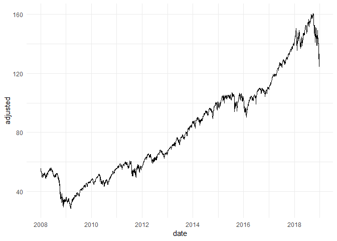

``` r
# combine together
sp500 <-
  "^GSPC" %>%
tq_get(get  = "stock.prices",
           from = "2010-01-01",
           to   = today()) %>%
    tq_transmute(select     = adjusted, 
                 mutate_fun = periodReturn, 
                 period     = "monthly", 
                 col_rename = "Rb")


vug <-
  "VUG" %>%
  tq_get(get  = "stock.prices",
           from = "2010-01-01",
           to   = "2018-12-28") %>%
    tq_transmute(select     = adjusted, 
                 mutate_fun = periodReturn, 
                 period     = "monthly", 
                 col_rename = "Rb")


sp500 %>%
  left_join(vug, by = "date") %>%
  rename(sp500 = Rb.x,
         vug = Rb.y) %>% 
  gather("type", "return", -date) %>%
  ggplot(aes(date, return, color = type)) +
  scale_colour_tableau(palette = "Tableau 10") +
  geom_point() +
  geom_line(show.legend = T, linetype = 1, size = .7, alpha = .5) +
  scale_y_continuous(labels = percent_format()) +
  labs(title = "monthly returns, SP 500 vs VUG ETF",
       x = "", y = "")
```

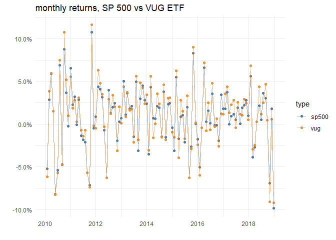

``` r
sp500 %>%
  left_join(vug, by = "date") %>%
  rename(sp500 = Rb.x,
         vug = Rb.y) %>% 
  gather("type", "return", -date) %>%
  ggplot(aes(date, return, color = type)) +
  scale_colour_tableau(palette = "Tableau 10") +
  geom_line(show.legend = F, linetype = 1, size = .6, 
            alpha = 1) +
  geom_point(size = .99, show.legend = F) +
  scale_y_continuous(labels = percent_format()) +
  labs(x = "", y = "") + 
  facet_wrap(~type) +
  theme()
```

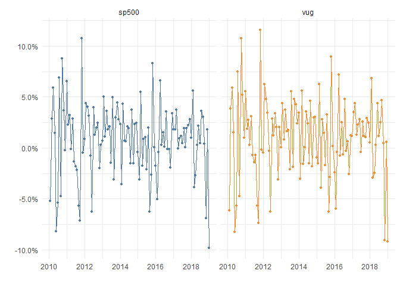
