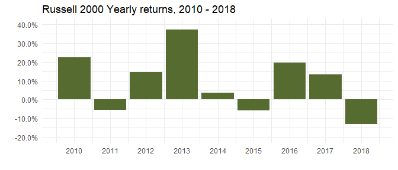
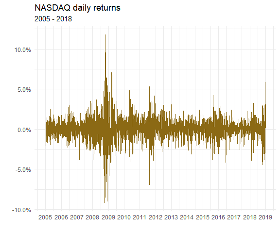
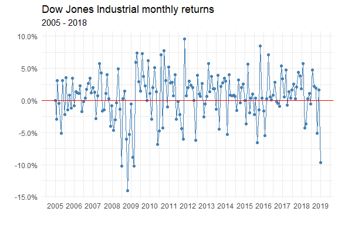
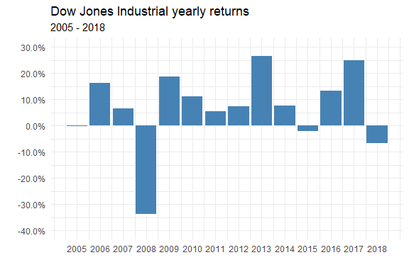
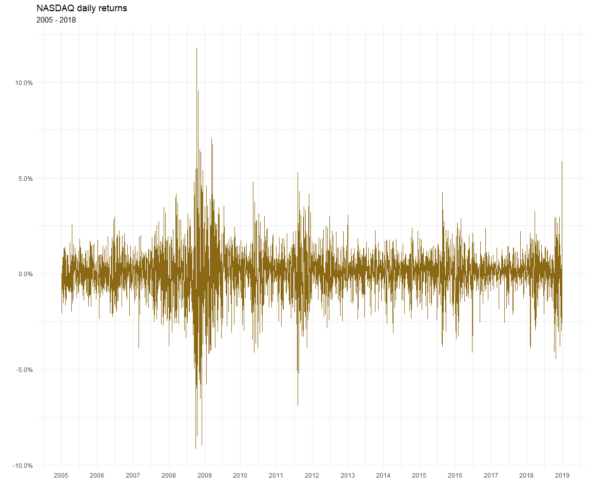

indexes
================
DanielH
December 29, 2018

-   [Russell 2000](#russell-2000)
-   [dow jones industrial](#dow-jones-industrial)
-   [nasdaq composite](#nasdaq-composite)

``` r
library(tidyverse)
library(purrrlyr)
library(tidyquant)
library(XLConnect)
library(gridExtra)
library(ggthemes)
library(scales)
library(knitr)

# set theme
theme_set(theme_minimal())
```

Russell 2000
------------

The Russell 2000 Index is a small-cap stock market index of the bottom 2,000 stocks in the Russell 3000 Index. The index is maintained by FTSE Russell, a subsidiary of the London Stock Exchange Group

> The Russell 2000 is by far the most common benchmark for mutual funds that identify themselves as "small-cap"

while the S&P 500 index is used primarily for large capitalization stocks. It is the most widely quoted measure of the overall performance of the small-cap to mid-cap company shares.

``` r
# RUSSELL 2000 monthly returns
russ2000_monthly_returns <-
  "^RUT" %>%
  tq_get(get  = "stock.prices",
           from = "2008-01-01",
           to   = today()) %>%
  tq_transmute(select     = adjusted,
               mutate_fun = periodReturn,
               period     = "monthly",
               col_rename = "Rb")


# RUSSELL 2000 yearly returns
russ2000_yearly_returns <-
  "^RUT" %>%
  tq_get(get  = "stock.prices",
           from = "2010-01-01",
           to   = today()) %>%
  tq_transmute(select     = adjusted,
               mutate_fun = periodReturn,
               period     = "yearly",
               col_rename = "Rb")

# plot R2000 yearly returns
russ2000_yearly_returns %>%
  ggplot(aes(year(date), Rb)) +
  geom_bar(stat = "identity", fill = "darkolivegreen") +
  scale_y_continuous(labels = percent_format(),
                     limits = c(-0.2, 0.4),
                     breaks = c(-0.2, -0.1, 0, 0.1, 0.2, 0.3, 0.4)) +
  scale_x_continuous(breaks =  seq.int(2010, 2018, 1)) +
  labs(title = "Russell 2000 Yearly returns, 2010 - 2018",
       x = "", y = "")
```



dow jones industrial
--------------------

<https://www.macrotrends.net/2481/stock-market-performance-by-president>

``` r
# daily returns
dij_daily_returns <-
  "DJI" %>%
  tq_get(get  = "stock.prices",
           from = "2005-01-03",
           to   = today()) %>%
  tq_transmute(select     = adjusted,
               mutate_fun = periodReturn,
               period     = "daily",
               col_rename = "Rb")
```

    ## Warning in to_period(xx, period = on.opts[[period]], ...): missing values
    ## removed from data

``` r
# plot daily returns
dij_daily_returns %>%
  ggplot(aes(date, Rb)) +
  geom_line(alpha = .6, color = "steelblue", size = .2) +
  geom_hline(yintercept = 0, color = "red") +
  scale_y_continuous(labels = percent_format(),
                     limits = c(-.10, .10)) +
  scale_x_date(date_breaks = "1 year", date_labels = "%Y") +
  labs(title = "Dow Jones Industrial daily returns",
       subtitle = "2005 - 2018",
        x = "", y = "")
```



``` r
# monthly returns
dij_monthly_returns <-
  "DJI" %>%
  tq_get(get  = "stock.prices",
           from = "2004-12-31",
           to   = today()) %>%
  tq_transmute(select     = adjusted,
               mutate_fun = periodReturn,
               period     = "monthly",
               col_rename = "Rb")

# plot monthly returns
dij_monthly_returns %>%
  ggplot(aes(date, Rb)) +
  geom_line(size = .03, color = "steelblue") +
  geom_point(size = 1.25, color = "steelblue") +
  geom_hline(yintercept = 0, color = "red",
             size = .7) +
  scale_x_date(date_breaks = "1 year", date_labels = "%Y") +
  scale_y_continuous(labels = percent_format()) +
  labs(title = "Dow Jones Industrial monthly returns",
       subtitle = "2005 - 2018",
        x = "", y = "")
```



``` r
# yearly returns
dji_yearly_returns <-
  "DJI" %>%
  tq_get(get  = "stock.prices",
           from = "2005-01-01",
           to   = today()) %>%
  tq_transmute(select     = adjusted,
               mutate_fun = periodReturn,
               period     = "yearly",
               col_rename = "Rb")
```

    ## Warning in to_period(xx, period = on.opts[[period]], ...): missing values
    ## removed from data

``` r
# plot yearly returns
dji_yearly_returns  %>%
  ggplot(aes(year(date), Rb)) +
  geom_bar(stat = "identity", fill = "steelblue") +
  scale_x_continuous(breaks =  seq.int(2005, 2018, 1)) +
  scale_y_continuous(labels = percent_format(), limits = c(-0.4, 0.3),
                     breaks = c(-0.4, -0.3, -0.2, -0.1, 0, 0.1, 0.2, 0.3)) +
  labs(title = "Dow Jones Industrial yearly returns",
       subtitle = "2005 - 2018",
        x = "", y = "")
```



nasdaq composite
----------------

``` r
# NASDAQ daily returns
nasdaq_daily_returns <-
  "^IXIC" %>%
  tq_get(get  = "stock.prices",
           from = "2005-01-01",
           to   = today()) %>%
  tq_transmute(select     = adjusted,
               mutate_fun = periodReturn,
               period     = "daily",
               col_rename = "Rb")

# plot daily returns
daily_plot <-
  nasdaq_daily_returns %>%
  ggplot(aes(date, Rb)) +
  geom_line(color = "goldenrod4") +
  scale_x_date(date_breaks = "1 year", date_labels = "%Y") +
  scale_y_continuous(labels = percent_format()) +
  labs(title = "NASDAQ daily returns",
       subtitle = "2005 - 2018",
        x = "", y = "")

# NASDAQ monthly returns
nasdaq_monthly_returns <-
  "^IXIC" %>%
  tq_get(get  = "stock.prices",
           from = "2005-01-01",
           to   = today()) %>%
  tq_transmute(select     = adjusted,
               mutate_fun = periodReturn,
               period     = "monthly",
               col_rename = "Rb")


# plot monthly returns
monthly_plot <-
  nasdaq_monthly_returns %>%
  ggplot(aes(date, Rb)) +
  geom_line(color = "goldenrod4", size = .03) +
  geom_point(color = "goldenrod4",size = 1.25) +
  geom_hline(yintercept = 0) +
  scale_y_continuous(labels = percent_format(), limits = c(-.2, .16)) +
  scale_x_date(date_breaks = "1 year", date_labels = "%Y") +
  labs(title = "NASDAQ monthly returns",
       subtitle = "2005 - 2018",
        x = "", y = "")


# NASDAQ yearly returns
nasdaq_yearly_return <-
  "^IXIC" %>%
  tq_get(get  = "stock.prices",
           from = "2005-01-01",
           to   = today()) %>%
  tq_transmute(select     = adjusted,
               mutate_fun = periodReturn,
               period     = "yearly",
               col_rename = "Rb") 


# plot yearly returns
yearly_plot <-
  nasdaq_yearly_return %>%
  ggplot(aes(year(date), Rb)) +
  geom_bar(stat = "identity", fill = "goldenrod4") +
  scale_x_continuous(breaks =  seq.int(2005, 2018, 1)) +
  scale_y_continuous(labels = percent_format(), limits = c(-.48, .48)) +
  labs(title = "NASDAQ yearly returns",
       subtitle = "2005 - 2018",
        x = "", y = "")

  
# plot growth
growth_plot <-
  nasdaq_daily_returns %>%
  mutate(cumul = cumsum(Rb)) %>%
  ggplot(aes(date, cumul)) +
  geom_line(color = "goldenrod4") +
  geom_smooth(color =  "black", size = .75) +
  scale_y_continuous(labels = percent_format()) +
  scale_x_date(date_breaks = "1 year", date_labels = "%Y") +
  labs(title = "NASDAQ performance",
       subtitle = "2005 - 2018",
        x = "", y = "")


# put together
grid.arrange(daily_plot, monthly_plot, yearly_plot, growth_plot)
```

    ## `geom_smooth()` using method = 'gam' and formula 'y ~ s(x, bs = "cs")'


