---


## Standard & Poor's 500

* https://www.investopedia.com/terms/s/sp500.asp

Standard & Poor's 500 Index (known commonly as the S&P 500) is a larger and more diverse index than the DJIA. Made up of 500 of the most widely traded stocks in the U.S., it represents about 80% of the total value of U.S. stock markets. 

>In general, the S&P 500 index gives a good indication of movement in the U.S. marketplace as a whole.

Because __the S&P 500 index is__ market weighted (also referred to as __capitalization weighted__), every stock in the index is represented in proportion to its total market capitalization. In other words, if the total market value of all 500 companies in the S&P 500 drops by 10%, the value of the index also drops by 10%.

A 10% movement in all stocks in the DJIA, by contrast, would not necessarily cause a 10% change in the index. Many people consider the market weighting used in the S&P 500 to be a better measure of the market's movement because two portfolios can be more easily compared when changes are measured in percentages rather than dollar amounts.

>The S&P 500 index includes companies in a variety of sectors, including energy, industrials, information technology, healthcare, financials and consumer staples.


```r
# daily returns
sp500_daily_returns <-
  "^GSPC" %>%
  tq_get(get  = "stock.prices",
           from = "1999-01-01",
           to   = "2019-01-01") %>%
  tq_transmute(select     = adjusted,
               mutate_fun = periodReturn,
               period     = "daily",
               col_rename = "Rb")


# daily plot
sp500_daily_returns %>%
  ggplot(aes(date, Rb)) +
  geom_line(color = "darkgreen") +
  scale_y_continuous(labels = percent_format()) +
  labs(title = "S&P 500 daily returns",
       subtitle = "2005-2018",
       x = "", y = "") +
  scale_x_date(date_breaks = "1 year", date_labels = "%Y") +
  theme(plot.title = element_text(size = 20,
                                  family = "Times",
                                  face = "bold",
                                  color = "black",
                                  hjust = 0.5,
                                  vjust = 2,
                                  lineheight = 2),
        plot.subtitle = element_text(size = 14,
                                     hjust = 0.5,
                                     face = "italic"))
```

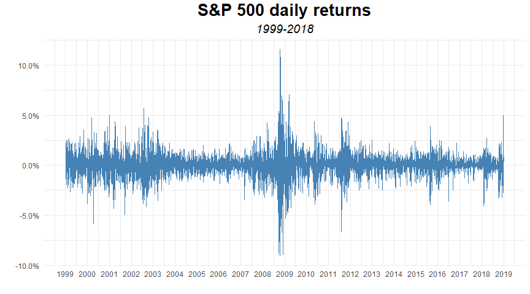<!-- -->

```r
# monthly returns
sp500_monthly_returns <-
  "^GSPC" %>%
  tq_get(get  = "stock.prices",
           from = "1999-01-01",
           to   = "2019-01-01") %>% 
  tq_transmute(select     = adjusted,
               mutate_fun = periodReturn,
               period     = "monthly",
               col_rename = "Rb")

# monthly plot
sp500_monthly_returns %>%
  ggplot(aes(date, Rb)) +
  geom_line(color = "darkgreen") +
  geom_point(color = "darkgreen") +
  geom_hline(yintercept = 0, color = "red") +
  scale_x_date(date_breaks = "1 year", date_labels = "%Y") +
  scale_y_continuous(labels = percent_format(), limits = c(-.15, .1)) +
  theme(plot.title = element_text(size = 20,
                                  family = "Times",
                                  face = "bold",
                                  color = "black",
                                  hjust = 0.5,
                                  vjust = 2,
                                  lineheight = 2),
        plot.subtitle = element_text(size = 14,
                                     hjust = 0.5,
                                     face = "italic")) +
  labs(title = "S&P 500 monthly returns",
       subtitle = "2005-2018",
       x = "", y = "")
```

<!-- -->

```r
# yearly returns
sp500_yearly_returns <-
  "^GSPC" %>%
  tq_get(get  = "stock.prices",
           from = "1999-01-01",
           to   = "2019-01-01") %>% 
  tq_transmute(select     = adjusted,
               mutate_fun = periodReturn,
               period     = "yearly",
               col_rename = "Rb")

# plot yearly
sp500_yearly_returns %>%
  ggplot(aes(year(date), Rb)) +
  geom_bar(stat = "identity", fill = "darkgreen") +
  scale_x_continuous(breaks =  seq.int(1999, 2018, 1)) +
  scale_y_continuous(labels = percent_format()) +
  theme(plot.title = element_text(size = 20,
                                  family = "Times",
                                  face = "bold",
                                  color = "black",
                                  hjust = 0.5,
                                  vjust = 2,
                                  lineheight = 2),
        plot.subtitle = element_text(size = 14,
                                     hjust = 0.5,
                                     face = "italic")) +
  labs(title = "S&P 500 yearly returns",
       subtitle = "1999-2018",
       x = "", y = "")
```

<!-- -->


## NASDAQ Composite

* https://www.investopedia.com/terms/n/nasdaqcompositeindex.asp

Most investors know that the Nasdaq is the exchange on which technology stocks are traded. 

>The Nasdaq Composite Index is a market-capitalization-weighted index of all stocks traded on the Nasdaq stock exchange. 

This index includes some companies that are not based in the U.S.

Although this index is known for its large portion of technology stocks, the Nasdaq Composite also includes stocks from financial, industrial, insurance and transportation industries, among others. 

__The Nasdaq Composite includes large and small firms but, unlike the Dow and the S&P 500, it also includes many speculative companies with small market capitalizations. Consequently, its movement generally indicates the performance of the technology industry as well as investors' attitudes toward more speculative stocks.__


```r
# NASDAQ daily returns
nasdaq_daily_returns <-
  "^IXIC" %>%
  tq_get(get  = "stock.prices",
           from = "1999-01-01",
           to   = "2019-01-01") %>% 
  tq_transmute(select     = adjusted,
               mutate_fun = periodReturn,
               period     = "daily",
               col_rename = "Rb")

# plot daily returns
nasdaq_daily_returns %>%
  ggplot(aes(date, Rb)) +
  geom_line(color = "goldenrod4") +
  scale_x_date(date_breaks = "1 year", date_labels = "%Y") +
  scale_y_continuous(labels = percent_format()) +
  theme(plot.title = element_text(size = 20,
                                  family = "Times",
                                  face = "bold",
                                  color = "black",
                                  hjust = 0.5,
                                  vjust = 2,
                                  lineheight = 2),
        plot.subtitle = element_text(size = 14,
                                     hjust = 0.5,
                                     face = "italic")) +
  labs(title = "NASDAQ daily returns",
       subtitle = "1999 - 2018",
        x = "", y = "")
```

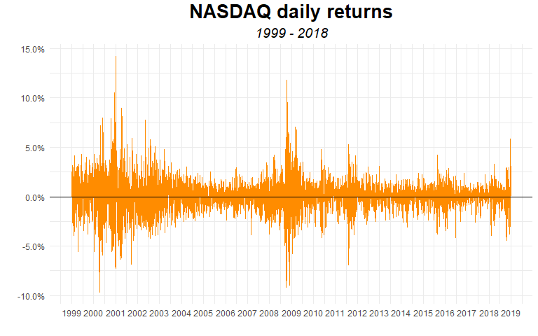<!-- -->

```r
# NASDAQ monthly returns
nasdaq_monthly_returns <-
  "^IXIC" %>%
  tq_get(get  = "stock.prices",
           from = "1999-01-01",
           to   = "2019-01-01") %>% 
  tq_transmute(select     = adjusted,
               mutate_fun = periodReturn,
               period     = "monthly",
               col_rename = "Rb")


# plot monthly returns
nasdaq_monthly_returns %>%
  ggplot(aes(date, Rb)) +
  geom_line(color = "goldenrod4", size = .03) +
  geom_point(color = "goldenrod4",size = 1.25) +
  geom_hline(yintercept = 0) +
  scale_y_continuous(labels = percent_format(), limits = c(-.2, .16)) +
  scale_x_date(date_breaks = "1 year", date_labels = "%Y") +
  theme(plot.title = element_text(size = 20,
                                  family = "Times",
                                  face = "bold",
                                  color = "black",
                                  hjust = 0.5,
                                  vjust = 2,
                                  lineheight = 2),
        plot.subtitle = element_text(size = 14,
                                     hjust = 0.5,
                                     face = "italic")) +
  labs(title = "NASDAQ monthly returns",
       subtitle = "1999 - 2018",
        x = "", y = "")
```

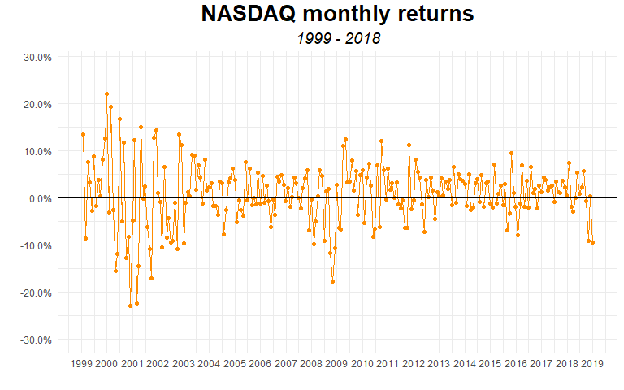<!-- -->

```r
# NASDAQ yearly returns
nasdaq_yearly_returns <-
  "^IXIC" %>%
  tq_get(get  = "stock.prices",
           from = "1999-01-01",
           to   = "2019-01-01") %>% 
  tq_transmute(select     = adjusted,
               mutate_fun = periodReturn,
               period     = "yearly",
               col_rename = "Rb") 


# plot yearly returns
nasdaq_yearly_returns %>%
  ggplot(aes(year(date), Rb)) +
  geom_bar(stat = "identity", fill = "goldenrod4") +
  scale_x_continuous(breaks =  seq.int(1999, 2018, 1)) +
  scale_y_continuous(labels = percent_format(), limits = c(-.48, .48)) +
  theme(plot.title = element_text(size = 20,
                                  family = "Times",
                                  face = "bold",
                                  color = "black",
                                  hjust = 0.5,
                                  vjust = 2,
                                  lineheight = 2),
        plot.subtitle = element_text(size = 14,
                                     hjust = 0.5,
                                     face = "italic")) +
  labs(title = "NASDAQ yearly returns",
       subtitle = "1999 - 2018",
        x = "", y = "")
```

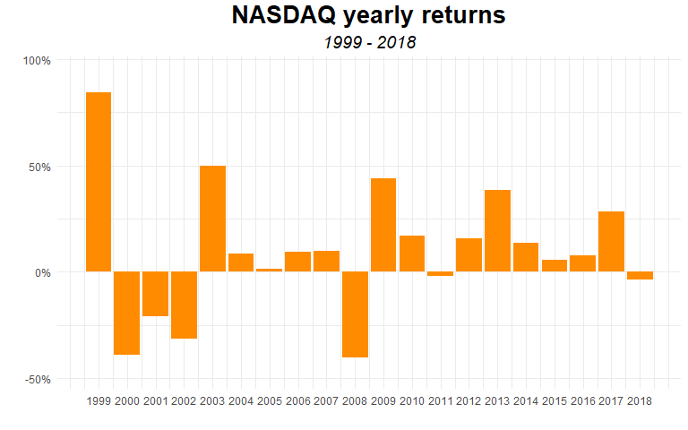<!-- -->

## Dow Jones Industrial Average

* https://www.investopedia.com/terms/d/djia.asp

>The Dow Jones Industrial Average (_DJIA_) is one of the oldest, most well-known and most frequently used indices in the world. It includes the stocks of 30 of the largest and most influential companies in the United States. 

The DJIA is what's known as a price-weighted index. It was originally computed by adding up the per-share price of the stocks of each company in the index and dividing this sum by the number of companies—that's why it's called an average. Unfortunately, it is no longer this simple to calculate. Over the years, stock splits, spin-offs, and other events have resulted in changes in the divisor, making it a very small number (less than 0.2).

The DJIA represents about a quarter of the value of the entire U.S. stock market, but a percent change in the Dow should not be interpreted as a definite indication that the entire market has dropped by the same percent. This is because of the Dow's price-weighted function. The basic problem is that a $1 change in the price of a $120 stock in the index will have a greater effect on the DJIA than a $1 change in the price of a $20 stock, even though the higher-priced stock may have changed by only 0.8% and the other by 5%.

A change in the Dow represents changes in investors' expectations of the earnings and risks of the large companies included in the average. Because the general attitude toward large-cap stocks often differs from the attitude toward small-cap stocks, international stocks or technology stocks, the Dow should not be used to represent sentiment in other areas of the marketplace. On the other hand, because the Dow is made up of some of the most well-known companies in the U.S., large swings in this index generally correspond to the movement of the entire market, although not necessarily on the same scale.

https://www.macrotrends.net/2481/stock-market-performance-by-president


```r
# daily returns
dij_daily_returns <-
  "DJI" %>%
  tq_get(get  = "stock.prices",
           from = "1999-01-01",
           to   = "2019-01-01") %>%
  tq_transmute(select     = adjusted,
               mutate_fun = periodReturn,
               period     = "daily",
               col_rename = "Rb")


# plot daily returns
dij_daily_returns %>%
  ggplot(aes(date, Rb)) +
  geom_line(color = "steelblue", size = .2) +
  geom_hline(yintercept = 0, color = "red") +
  scale_y_continuous(labels = percent_format(),
                     limits = c(-.10, .10)) +
  scale_x_date(date_breaks = "1 year", date_labels = "%Y") +
  theme(plot.title = element_text(size = 20,
                                  family = "Times",
                                  face = "bold",
                                  color = "black",
                                  hjust = 0.5,
                                  vjust = 2,
                                  lineheight = 2),
        plot.subtitle = element_text(size = 14,
                                     hjust = 0.5,
                                     face = "italic")) +
  labs(title = "DJIA daily returns",
       subtitle = "1999 - 2018",
        x = "", y = "")
```

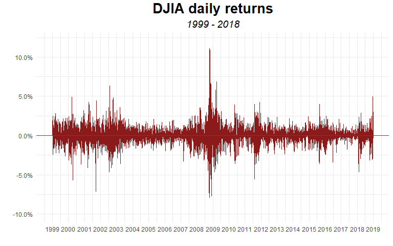<!-- -->

```r
# monthly returns
dij_monthly_returns <-
  "DJI" %>%
  tq_get(get  = "stock.prices",
           from = "1999-01-01",
           to   = "2019-01-01") %>% 
  tq_transmute(select     = adjusted,
               mutate_fun = periodReturn,
               period     = "monthly",
               col_rename = "Rb")


# plot monthly returns
dij_monthly_returns %>%
  ggplot(aes(date, Rb)) +
  geom_line(size = .03, color = "steelblue") +
  geom_point(size = 1.25, color = "steelblue") +
  geom_hline(yintercept = 0, color = "red",
             size = .7) +
  scale_x_date(date_breaks = "1 year", date_labels = "%Y") +
  scale_y_continuous(labels = percent_format()) +
  theme(plot.title = element_text(size = 20,
                                  family = "Times",
                                  face = "bold",
                                  color = "black",
                                  hjust = 0.5,
                                  vjust = 2,
                                  lineheight = 2),
        plot.subtitle = element_text(size = 14,
                                     hjust = 0.5,
                                     face = "italic")) +
  labs(title = "DJIA monthly returns",
       subtitle = "2005 - 2018",
        x = "", y = "")
```

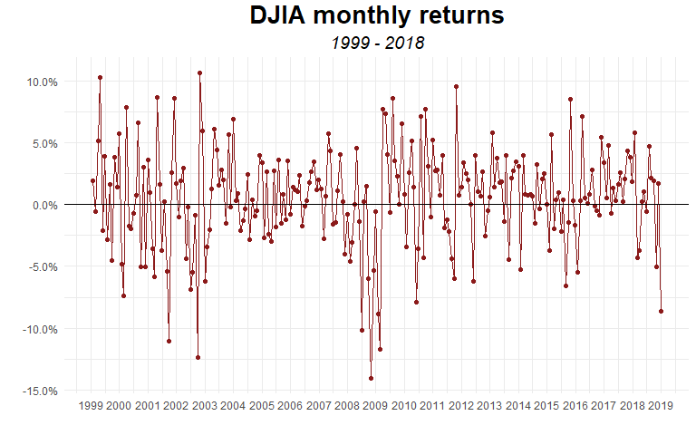<!-- -->

```r
# yearly returns
dji_yearly_returns <-
  "DJI" %>%
  tq_get(get  = "stock.prices",
           from = "1999-01-01",
           to   = "2019-01-01") %>% 
  tq_transmute(select     = adjusted,
               mutate_fun = periodReturn,
               period     = "yearly",
               col_rename = "Rb")


# plot yearly returns
dji_yearly_returns  %>%
  ggplot(aes(year(date), Rb)) +
  geom_bar(stat = "identity", fill = "steelblue") +
  scale_x_continuous(breaks =  seq.int(1999, 2018, 1)) +
  scale_y_continuous(labels = percent_format(), limits = c(-0.4, 0.3),
                     breaks = c(-0.4, -0.3, -0.2, -0.1, 0, 0.1, 0.2, 0.3)) +
  theme(plot.title = element_text(size = 20,
                                  family = "Times",
                                  face = "bold",
                                  color = "black",
                                  hjust = 0.5,
                                  vjust = 2,
                                  lineheight = 2),
        plot.subtitle = element_text(size = 14,
                                     hjust = 0.5,
                                     face = "italic")) +
  labs(title = "DJIA yearly returns",
       subtitle = "1999 - 2018",
        x = "", y = "")
```

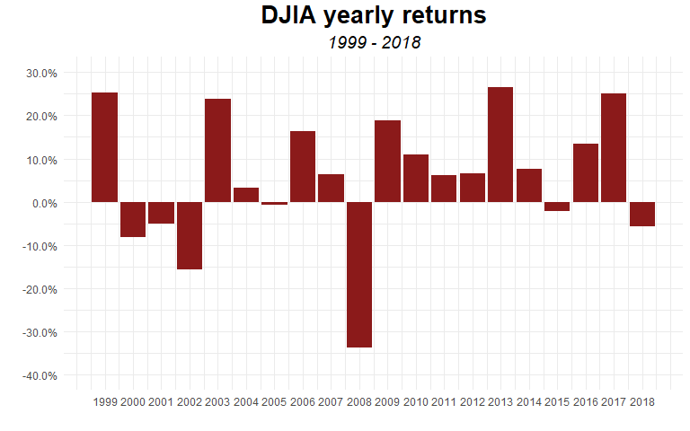<!-- -->


## Russell 2000

https://www.investopedia.com/terms/r/russell2000.asp

The Russell 2000 Index is a small-cap stock market index of the bottom 2,000 stocks in the Russell 3000 Index. The index is maintained by FTSE Russell, a subsidiary of the London Stock Exchange Group

>The Russell 2000 is by far the most common benchmark for mutual funds that identify themselves as "small-cap" 

while the S&P 500 index is used primarily for large capitalization stocks. It is the most widely quoted measure of the overall performance of the small-cap to mid-cap company shares.


```r
# RUSSELL 2000 daily returns
russ2000_daily_returns <-
  "^RUT" %>%
  tq_get(get  = "stock.prices",
           from = "1999-01-01",
           to   = "2019-01-01") %>% 
  tq_transmute(select     = adjusted,
               mutate_fun = periodReturn,
               period     = "daily",
               col_rename = "Rb")

# plot daily returns
russ2000_daily_returns %>%
  ggplot(aes(date, Rb)) +
  geom_line(color = "firebrick") +
  scale_y_continuous(labels = percent_format(),
                     limits = c(-.15, .10)) +
  scale_x_date(date_breaks = "1 year", date_labels = "%Y") +
  theme(plot.title = element_text(size = 20,
                                  family = "Times",
                                  face = "bold",
                                  color = "black",
                                  hjust = 0.5,
                                  vjust = 2,
                                  lineheight = 2),
        plot.subtitle = element_text(size = 14,
                                     hjust = 0.5,
                                     face = "italic")) +
  labs(title = "Russell 2000 daily returns",
       subtitle = "1999 - 2018",
        x = "", y = "")
```

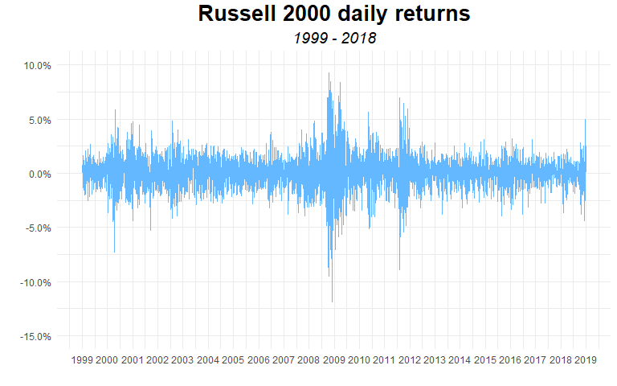<!-- -->

```r
# RUSSELL 2000 monthly returns
russ2000_monthly_returns <-
  "^RUT" %>%
  tq_get(get  = "stock.prices",
           from = "1999-01-01",
           to   = "2019-01-01") %>% 
  tq_transmute(select     = adjusted,
               mutate_fun = periodReturn,
               period     = "monthly",
               col_rename = "Rb")


# plot monthly returns
russ2000_monthly_returns %>%
  ggplot(aes(date, Rb)) +
  geom_line(color = "firebrick") +
  geom_point(color = "firebrick") +
  geom_hline(yintercept = 0, size = 1) +
  scale_y_continuous(labels = percent_format()) +
  scale_x_date(date_breaks = "1 year", date_labels = "%Y") +
  theme(plot.title = element_text(size = 20,
                                  family = "Times",
                                  face = "bold",
                                  color = "black",
                                  hjust = 0.5,
                                  vjust = 2,
                                  lineheight = 2),
        plot.subtitle = element_text(size = 14,
                                     hjust = 0.5,
                                     face = "italic")) +
  labs(title = "Russell 2000 monthly returns",
       subtitle = "1999 - 2018",
        x = "", y = "")
```

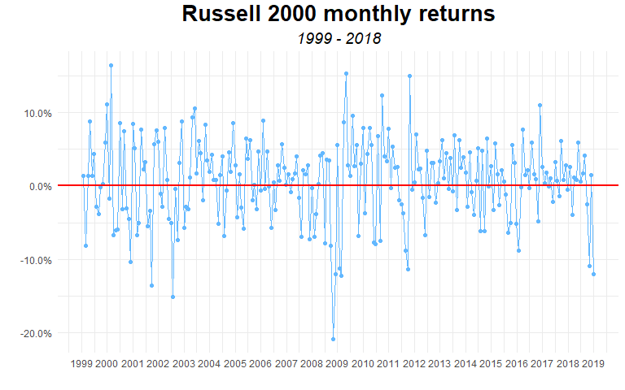<!-- -->

```r
# RUSSELL 2000 yearly returns
russ2000_yearly_returns <-
  "^RUT" %>%
  tq_get(get  = "stock.prices",
           from = "1999-01-01",
           to   = "2019-01-01") %>% 
  tq_transmute(select     = adjusted,
               mutate_fun = periodReturn,
               period     = "yearly",
               col_rename = "Rb")

# plot R2000 yearly returns
russ2000_yearly_returns %>%
  ggplot(aes(year(date), Rb)) +
  geom_bar(stat = "identity", fill = "firebrick") +
  scale_x_continuous(breaks =  seq.int(1999, 2018, 1)) +
  scale_y_continuous(labels = percent_format(),
                     limits = c(-0.4, 0.5)) +
  theme(plot.title = element_text(size = 20,
                                  family = "Times",
                                  face = "bold",
                                  color = "black",
                                  hjust = 0.5,
                                  vjust = 2,
                                  lineheight = 2),
        plot.subtitle = element_text(size = 14,
                                     hjust = 0.5,
                                     face = "italic")) +
  labs(title = "Russell 2000 yearly returns",
       subtitle = "1999 - 2018",
       x = "", y = "")
```

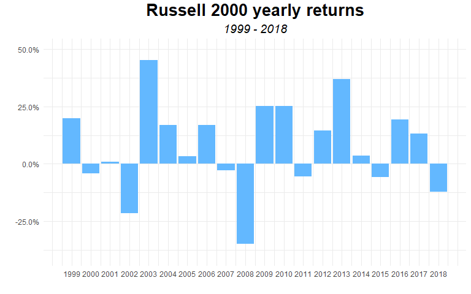<!-- -->


## total returns 2018

Here we want to look at the performance of our four indexes for the year 2018 


```r
# plot
tibble(`stock index` = c("SP500", "NASDAQ", "DJIA", "RUT"),
       ytd = c(sp500_yearly_returns %>% tail(1) %>% .[[2]],
               nasdaq_yearly_returns %>% tail(1) %>% .[[2]],
               dji_yearly_returns %>% tail(1) %>% .[[2]],
               russ2000_yearly_returns %>% tail(1) %>% .[[2]])) %>%
  dmap_at(1, as_factor) %>%
  ggplot(aes(`stock index`, ytd, fill = `stock index`)) +
  geom_bar(stat = "identity", show.legend = F) +
  scale_fill_tableau(palette = "Tableau 10") +
  scale_y_continuous(labels = percent_format()) +
  theme(plot.title = element_text(size = 18,
                                  family = "Times",
                                  face = "bold",
                                  color = "black",
                                  hjust = 0.5,
                                  vjust = 2,
                                  lineheight = 2),
        plot.subtitle = element_text(size = 12,
                                     hjust = 0.5,
                                     face = "italic"),
        axis.text.x = element_text(face = "bold",
                                   color = "black",
                                   size = 10)) +
  labs(title = "Major Markets 2018 Performance ",
       subtitle = "all major indexes show negative returns",
       x = "", y = "")
```

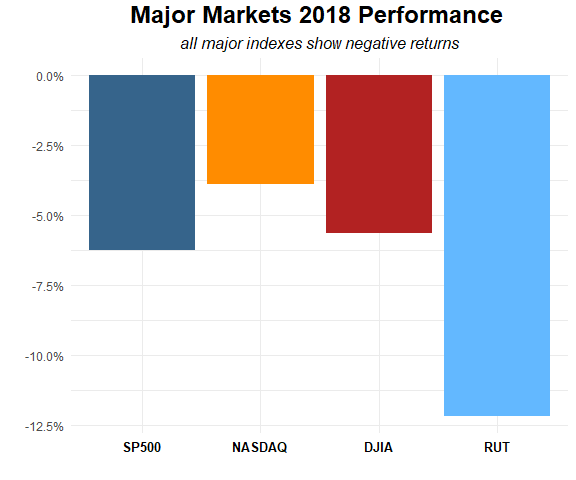

As we can see in 2018 all four indexes had a negative return. The biggest drop, -12% was for the RUSSELL 2000 index. The S&P 500 lost 6.2%, the DJIA 5.63%. Interestingly enough, the NASDAQ, supposedly a pretty volatile market lost less than any other index.

## total returns 1999 - 2018

In the following chuunk there's some cleaning to be done, because I removed the 10-yr analysis replacing it with a 20-yr analysis. Therefore, I odn't need to compute returns for 20 years, I already have them!!!!

I have to modify the following chunk removing the redundant "-20" stuff


```r
#-------------------- total returns for the last 20yrs -----------------

# SP500
sp500_yearly_returns_20 <-
  "^GSPC" %>%
  tq_get(get  = "stock.prices",
           from = "1999-01-01",
           to   = "2019-01-01") %>% 
  tq_transmute(select     = adjusted,
               mutate_fun = periodReturn,
               period     = "yearly",
               col_rename = "Rb")

# NASDAQ
nasdaq_yearly_returns_20 <-
  "^IXIC" %>%
   tq_get(get  = "stock.prices",
           from = "1999-01-01",
           to   = "2019-01-01") %>% 
  tq_transmute(select     = adjusted,
               mutate_fun = periodReturn,
               period     = "yearly",
               col_rename = "Rb")

# DJIA
dji_yearly_returns_20 <-
  "DJI" %>%
  tq_get(get  = "stock.prices",
           from = "1999-01-01",
           to   = "2019-01-01") %>% 
  tq_transmute(select     = adjusted,
               mutate_fun = periodReturn,
               period     = "yearly",
               col_rename = "Rb")


# RUT
russ2000_yearly_returns_20 <-
  "^RUT" %>%
  tq_get(get  = "stock.prices",
           from = "1999-01-01",
           to   = "2019-01-01") %>% 
  tq_transmute(select     = adjusted,
               mutate_fun = periodReturn,
               period     = "yearly",
               col_rename = "Rb")


# return table (tibble)
return_tibble <-
  tribble(~index, ~return,
        "SP500", c(sp500_yearly_returns_20 %>% .[[2]]),
        "NASDAQ", c(nasdaq_yearly_returns_20 %>% .[[2]]),
        "DJIA", c(dji_yearly_returns_20 %>% .[[2]]),
        "RUT", c(russ2000_yearly_returns_20 %>% .[[2]])) %>%
  unnest(return) %>% 
  mutate(year = rep(2018:1999, 4)) %>%
  select(3,1,2) %>%
  spread(year, return)

## ----------------------- long format tibble -------------------

# get names
column_names <-
  return_tibble %>%
  pull(index)

# long tibble
long_return_tbl <-
  return_tibble %>%
  t %>%
  as_tibble() %>%
  slice(-1)

colnames(long_return_tbl) <- column_names 

# add year column and format values
indexes_return_table <-
  long_return_tbl %>%
  mutate(year = rep(2018:1999)) %>%
  select(5, everything()) %>%
  dmap_at(c(2:5), as.numeric) %>% 
  dmap_if(is_double, percent, accuracy = .01) %>%
  select(1,5,3,2,4) %>%
  rename(" " = year)

# format table
indexes_return_table %>%
  mutate(DJIA = cell_spec(DJIA, color = ifelse(DJIA < 0, "red", "black"),
                          format = "html"),
         NASDAQ =  cell_spec(NASDAQ, color = ifelse(NASDAQ < 0, "red", "black"),
                          format = "html"),
         RUT = cell_spec(RUT, color = ifelse(RUT < 0, "red", "black"),
                          format = "html"),
         SP500 = cell_spec(SP500, color = ifelse(SP500 < 0, "red", "black"),
                          format = "html")) %>%
  kable(format = "html",  escape = F) %>%
  kable_styling(bootstrap_options = c("striped", "hover", "condensed"), 
                full_width = F, font_size = 14
                )
```

<table class="table table-striped table-hover table-condensed" style="font-size: 14px; width: auto !important; margin-left: auto; margin-right: auto;">
 <thead>
  <tr>
   <th style="text-align:right;">   </th>
   <th style="text-align:left;"> SP500 </th>
   <th style="text-align:left;"> NASDAQ </th>
   <th style="text-align:left;"> DJIA </th>
   <th style="text-align:left;"> RUT </th>
  </tr>
 </thead>
<tbody>
  <tr>
   <td style="text-align:right;"> 2018 </td>
   <td style="text-align:left;"> <span style="     color: red;">-6.24%</span> </td>
   <td style="text-align:left;"> <span style="     color: red;">-3.88%</span> </td>
   <td style="text-align:left;"> <span style="     color: red;">-5.63%</span> </td>
   <td style="text-align:left;"> <span style="     color: red;">-12.18%</span> </td>
  </tr>
  <tr>
   <td style="text-align:right;"> 2017 </td>
   <td style="text-align:left;"> <span style="     color: black;">19.42%</span> </td>
   <td style="text-align:left;"> <span style="     color: black;">28.24%</span> </td>
   <td style="text-align:left;"> <span style="     color: black;">25.08%</span> </td>
   <td style="text-align:left;"> <span style="     color: black;">13.14%</span> </td>
  </tr>
  <tr>
   <td style="text-align:right;"> 2016 </td>
   <td style="text-align:left;"> <span style="     color: black;">9.54%</span> </td>
   <td style="text-align:left;"> <span style="     color: black;">7.50%</span> </td>
   <td style="text-align:left;"> <span style="     color: black;">13.42%</span> </td>
   <td style="text-align:left;"> <span style="     color: black;">19.48%</span> </td>
  </tr>
  <tr>
   <td style="text-align:right;"> 2015 </td>
   <td style="text-align:left;"> <span style="     color: red;">-0.73%</span> </td>
   <td style="text-align:left;"> <span style="     color: black;">5.73%</span> </td>
   <td style="text-align:left;"> <span style="     color: red;">-2.23%</span> </td>
   <td style="text-align:left;"> <span style="     color: red;">-5.71%</span> </td>
  </tr>
  <tr>
   <td style="text-align:right;"> 2014 </td>
   <td style="text-align:left;"> <span style="     color: black;">11.39%</span> </td>
   <td style="text-align:left;"> <span style="     color: black;">13.40%</span> </td>
   <td style="text-align:left;"> <span style="     color: black;">7.52%</span> </td>
   <td style="text-align:left;"> <span style="     color: black;">3.53%</span> </td>
  </tr>
  <tr>
   <td style="text-align:right;"> 2013 </td>
   <td style="text-align:left;"> <span style="     color: black;">29.60%</span> </td>
   <td style="text-align:left;"> <span style="     color: black;">38.32%</span> </td>
   <td style="text-align:left;"> <span style="     color: black;">26.50%</span> </td>
   <td style="text-align:left;"> <span style="     color: black;">37.00%</span> </td>
  </tr>
  <tr>
   <td style="text-align:right;"> 2012 </td>
   <td style="text-align:left;"> <span style="     color: black;">13.41%</span> </td>
   <td style="text-align:left;"> <span style="     color: black;">15.91%</span> </td>
   <td style="text-align:left;"> <span style="     color: black;">7.26%</span> </td>
   <td style="text-align:left;"> <span style="     color: black;">14.63%</span> </td>
  </tr>
  <tr>
   <td style="text-align:right;"> 2011 </td>
   <td style="text-align:left;"> <span style="     color: black;">0.00%</span> </td>
   <td style="text-align:left;"> <span style="     color: red;">-1.80%</span> </td>
   <td style="text-align:left;"> <span style="     color: black;">5.53%</span> </td>
   <td style="text-align:left;"> <span style="     color: red;">-5.45%</span> </td>
  </tr>
  <tr>
   <td style="text-align:right;"> 2010 </td>
   <td style="text-align:left;"> <span style="     color: black;">12.78%</span> </td>
   <td style="text-align:left;"> <span style="     color: black;">16.91%</span> </td>
   <td style="text-align:left;"> <span style="     color: black;">11.02%</span> </td>
   <td style="text-align:left;"> <span style="     color: black;">25.31%</span> </td>
  </tr>
  <tr>
   <td style="text-align:right;"> 2009 </td>
   <td style="text-align:left;"> <span style="     color: black;">23.45%</span> </td>
   <td style="text-align:left;"> <span style="     color: black;">43.89%</span> </td>
   <td style="text-align:left;"> <span style="     color: black;">18.82%</span> </td>
   <td style="text-align:left;"> <span style="     color: black;">25.22%</span> </td>
  </tr>
  <tr>
   <td style="text-align:right;"> 2008 </td>
   <td style="text-align:left;"> <span style="     color: red;">-38.49%</span> </td>
   <td style="text-align:left;"> <span style="     color: red;">-40.54%</span> </td>
   <td style="text-align:left;"> <span style="     color: red;">-33.84%</span> </td>
   <td style="text-align:left;"> <span style="     color: red;">-34.80%</span> </td>
  </tr>
  <tr>
   <td style="text-align:right;"> 2007 </td>
   <td style="text-align:left;"> <span style="     color: black;">3.53%</span> </td>
   <td style="text-align:left;"> <span style="     color: black;">9.81%</span> </td>
   <td style="text-align:left;"> <span style="     color: black;">6.43%</span> </td>
   <td style="text-align:left;"> <span style="     color: red;">-2.75%</span> </td>
  </tr>
  <tr>
   <td style="text-align:right;"> 2006 </td>
   <td style="text-align:left;"> <span style="     color: black;">13.62%</span> </td>
   <td style="text-align:left;"> <span style="     color: black;">9.52%</span> </td>
   <td style="text-align:left;"> <span style="     color: black;">16.29%</span> </td>
   <td style="text-align:left;"> <span style="     color: black;">17.00%</span> </td>
  </tr>
  <tr>
   <td style="text-align:right;"> 2005 </td>
   <td style="text-align:left;"> <span style="     color: black;">3.00%</span> </td>
   <td style="text-align:left;"> <span style="     color: black;">1.37%</span> </td>
   <td style="text-align:left;"> <span style="     color: red;">-0.61%</span> </td>
   <td style="text-align:left;"> <span style="     color: black;">3.32%</span> </td>
  </tr>
  <tr>
   <td style="text-align:right;"> 2004 </td>
   <td style="text-align:left;"> <span style="     color: black;">8.99%</span> </td>
   <td style="text-align:left;"> <span style="     color: black;">8.59%</span> </td>
   <td style="text-align:left;"> <span style="     color: black;">3.15%</span> </td>
   <td style="text-align:left;"> <span style="     color: black;">17.00%</span> </td>
  </tr>
  <tr>
   <td style="text-align:right;"> 2003 </td>
   <td style="text-align:left;"> <span style="     color: black;">26.38%</span> </td>
   <td style="text-align:left;"> <span style="     color: black;">50.01%</span> </td>
   <td style="text-align:left;"> <span style="     color: black;">25.32%</span> </td>
   <td style="text-align:left;"> <span style="     color: black;">45.37%</span> </td>
  </tr>
  <tr>
   <td style="text-align:right;"> 2002 </td>
   <td style="text-align:left;"> <span style="     color: red;">-23.37%</span> </td>
   <td style="text-align:left;"> <span style="     color: red;">-31.53%</span> </td>
   <td style="text-align:left;"> <span style="     color: red;">-16.76%</span> </td>
   <td style="text-align:left;"> <span style="     color: red;">-21.58%</span> </td>
  </tr>
  <tr>
   <td style="text-align:right;"> 2001 </td>
   <td style="text-align:left;"> <span style="     color: red;">-13.04%</span> </td>
   <td style="text-align:left;"> <span style="     color: red;">-21.05%</span> </td>
   <td style="text-align:left;"> <span style="     color: red;">-7.09%</span> </td>
   <td style="text-align:left;"> <span style="     color: black;">1.03%</span> </td>
  </tr>
  <tr>
   <td style="text-align:right;"> 2000 </td>
   <td style="text-align:left;"> <span style="     color: red;">-10.14%</span> </td>
   <td style="text-align:left;"> <span style="     color: red;">-39.29%</span> </td>
   <td style="text-align:left;"> <span style="     color: red;">-6.18%</span> </td>
   <td style="text-align:left;"> <span style="     color: red;">-4.20%</span> </td>
  </tr>
  <tr>
   <td style="text-align:right;"> 1999 </td>
   <td style="text-align:left;"> <span style="     color: black;">19.64%</span> </td>
   <td style="text-align:left;"> <span style="     color: black;">84.29%</span> </td>
   <td style="text-align:left;"> <span style="     color: black;">25.18%</span> </td>
   <td style="text-align:left;"> <span style="     color: black;">19.82%</span> </td>
  </tr>
</tbody>
</table>


---

## summary statistics, 1999-2008


```r
# transposed tibble
summary_stats_tbl <-
  long_return_tbl %>%
  gather("index", "value") %>% 
  mutate_at(2, as.numeric) %>%
  group_by(index) %>%
  summarize(mean = mean(value),
            stdev = sd(value),
            max = max(value),
            min = min(value)) %>%
  rename(" " = index) %>%
  dmap_at(c(2:5), percent) %>%
  t() %>%
  as_tibble()

colnames(summary_stats_tbl) <- 
  summary_stats_tbl %>%
  slice(1) %>%
  as_vector() %>% 
  unname()


summary_stats_tbl <-
  summary_stats_tbl %>%
  slice(-1) %>%
  mutate(" " = c("mean", "stdev", "max", "min")) %>%
  select(" ", everything()) %>%
  kable() %>%
  kable_styling("striped", full_width = F)
  

summary_stats_tbl
```

<table class="table table-striped" style="width: auto !important; margin-left: auto; margin-right: auto;">
 <thead>
  <tr>
   <th style="text-align:left;">   </th>
   <th style="text-align:left;"> DJIA </th>
   <th style="text-align:left;"> NASDAQ </th>
   <th style="text-align:left;"> RUT </th>
   <th style="text-align:left;"> SP500 </th>
  </tr>
 </thead>
<tbody>
  <tr>
   <td style="text-align:left;"> mean </td>
   <td style="text-align:left;"> 5.96% </td>
   <td style="text-align:left;"> 9.77% </td>
   <td style="text-align:left;"> 7.76% </td>
   <td style="text-align:left;"> 5.14% </td>
  </tr>
  <tr>
   <td style="text-align:left;"> stdev </td>
   <td style="text-align:left;"> 15.5% </td>
   <td style="text-align:left;"> 30.4% </td>
   <td style="text-align:left;"> 19.4% </td>
   <td style="text-align:left;"> 17.1% </td>
  </tr>
  <tr>
   <td style="text-align:left;"> max </td>
   <td style="text-align:left;"> 26.5% </td>
   <td style="text-align:left;"> 84.3% </td>
   <td style="text-align:left;"> 45.4% </td>
   <td style="text-align:left;"> 29.6% </td>
  </tr>
  <tr>
   <td style="text-align:left;"> min </td>
   <td style="text-align:left;"> -33.84% </td>
   <td style="text-align:left;"> -40.54% </td>
   <td style="text-align:left;"> -34.80% </td>
   <td style="text-align:left;"> -38.49% </td>
  </tr>
</tbody>
</table>


---


```r
# tibble for the table
tribble(~index, ~return,
        "SP500", c(sp500_yearly_returns_20 %>% .[[2]]),
        "NASDAQ", c(nasdaq_yearly_returns_20 %>% .[[2]]),
        "DJIA", c(dji_yearly_returns_20 %>% .[[2]]),
        "RUT", c(russ2000_yearly_returns_20 %>% .[[2]])) %>%
  unnest(return) %>% 
  mutate(year = rep(2018:1999, 4),
         index = factor(index)) %>%
  select(3,1,2)


# tibble for plot
tribble(~index, ~return,
        "SP500", c(sp500_yearly_returns_20),
        "NASDAQ", c(nasdaq_yearly_returns_20),
        "DJIA", c(dji_yearly_returns_20),
        "RUT", c(russ2000_yearly_returns_20)) %>%
 pull(return) %>%
  set_names(c("SP500", "NASDAQ", "DJIA", "RUT")) # so far we have a list. turn it into tbl!
  
# check charlotte Wickham stuff!!!!


# plot growth
nasdaq_daily_returns %>%
  mutate(cumul = cumsum(Rb)) %>%
  ggplot(aes(date, cumul)) +
  geom_line(color = "goldenrod4") +
  geom_smooth(color =  "black", size = .75) +
  scale_y_continuous(labels = percent_format()) +
  scale_x_date(date_breaks = "1 year", date_labels = "%Y") +
  theme(plot.title = element_text(size = 20,
                                  family = "Times",
                                  face = "bold",
                                  color = "black",
                                  hjust = 0.5,
                                  vjust = 2,
                                  lineheight = 2),
        plot.subtitle = element_text(size = 14,
                                     hjust = 0.5,
                                     face = "italic")) +
  labs(title = "NASDAQ performance",
       subtitle = "1999 - 2018",
        x = "", y = "")
```


* https://www.investopedia.com/articles/basics/09/simplified-measuring-interpreting-volatility.asp

#####rmarkdown docs

Start from here: https://bookdown.org/yihui/rmarkdown/documents.html

https://bookdown.org/yihui/rmarkdown/markdown-document.html

TO DO List, Thursday Jan 03

The kableExtra formatting doesn't get rendered in .md files (`Knit to github_document`)


#### table packages

https://davidgohel.github.io/ReporteRs/articles/FlexTable.html#format-table

this???? https://stackoverflow.com/questions/25315309/conditional-formatting-tables-in-rmarkdown-documents

https://cran.r-project.org/web/packages/kableExtra/vignettes/awesome_table_in_html.html

https://hughjonesd.github.io/huxtable/huxtable.pdf

https://renkun-ken.github.io/formattable/

https://davidgohel.github.io/flextable/index.html


